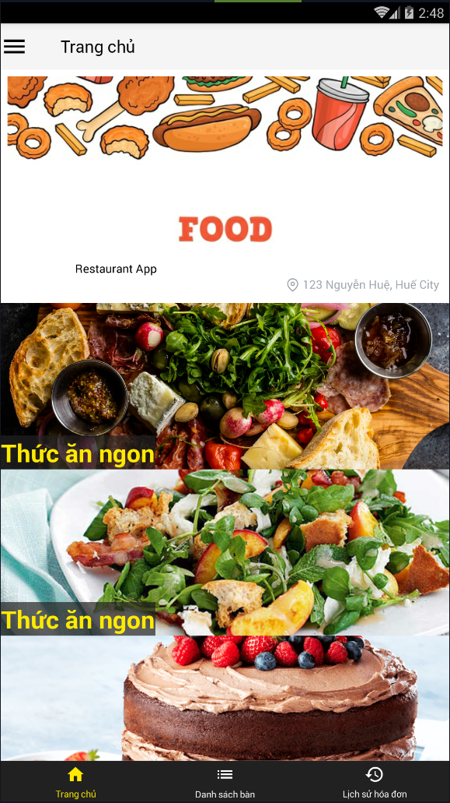
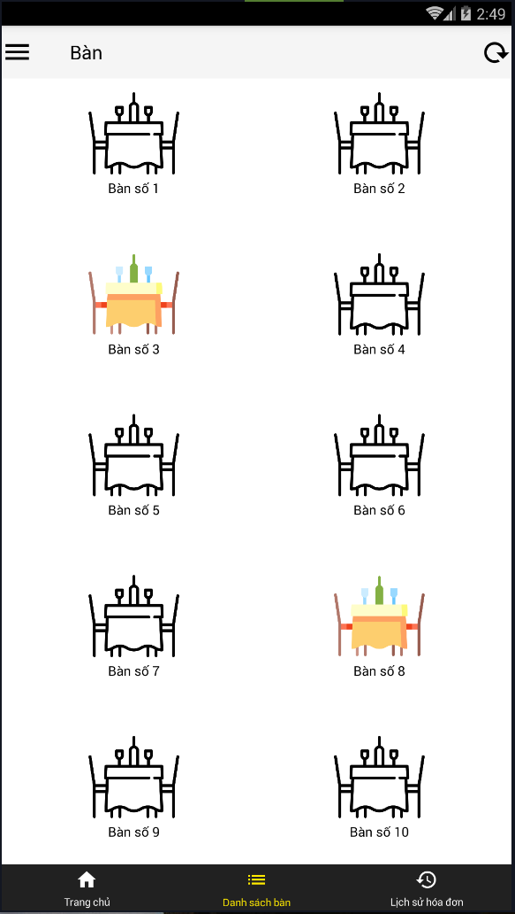
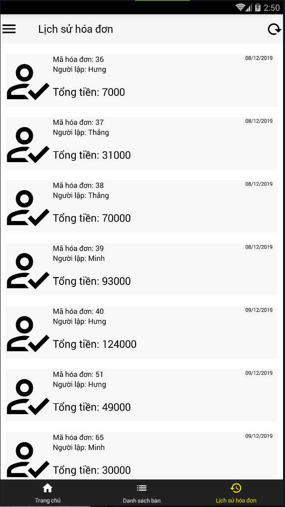
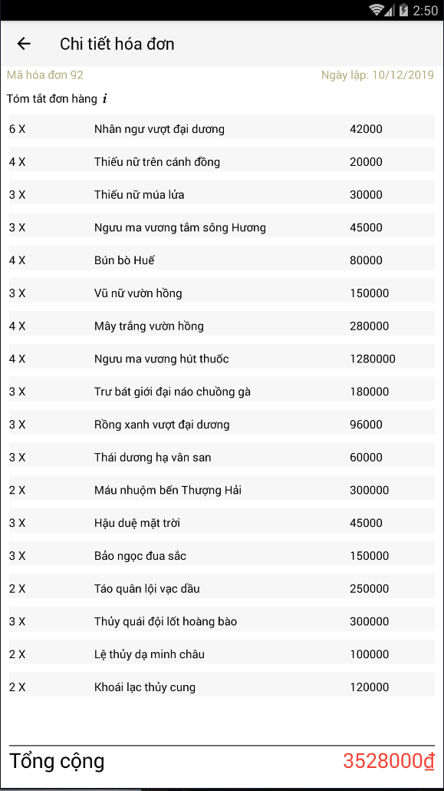

# OrderFoodForTableAndroidApp
write some things about app here.

### iOS
In the root directory
* Install dependencies: `npm install`
### Android
* You might need to do this to run it in Android Studio or on real device: `adb reverse tcp:8081 tcp:8081`
* If you run this app in emulator to test you need connect with `adb connect 127.0.0.1:62001` (for [Nox](https://vn.bignox.com/)
* And for the sample server: `adb reverse tcp:3000 tcp:3000`
* To run from command line try: `react-native run-android`
